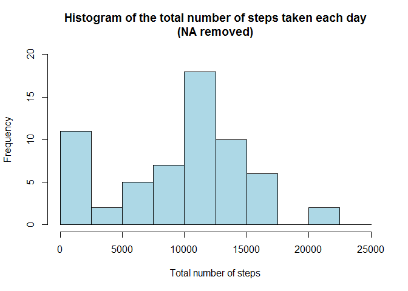
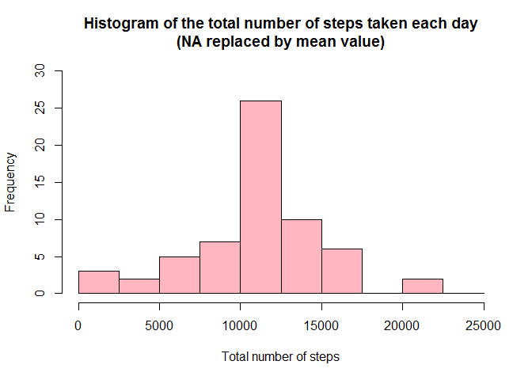

# Reproducible Research: Peer Assessment 1

##Loading and preprocessing the data
1. Load the data (i.e. read.csv())

```r
#Set initial
setwd("C:\\ILYA\\ILYA\\Coursera\\R\\RepRes")
filePath<-"./data/"

# Load the raw activity data
activity_raw <- read.csv(paste0(filePath,"activity.csv"), stringsAsFactors=FALSE)
head(activity_raw)
```

```
##   steps       date interval
## 1    NA 2012-10-01        0
## 2    NA 2012-10-01        5
## 3    NA 2012-10-01       10
## 4    NA 2012-10-01       15
## 5    NA 2012-10-01       20
## 6    NA 2012-10-01       25
```

2. Process/transform the data (if necessary) into a format suitable for analysis

```r
# Transform the date attribute to an actual date format
activity_raw$date <- as.POSIXct(activity_raw$date, format="%Y-%m-%d")

# Compute the weekdays from the date attribute
activity_raw <- data.frame(date=activity_raw$date, 
                           weekday=tolower(weekdays(activity_raw$date)), 
                           steps=activity_raw$steps, 
                           interval=activity_raw$interval)

# Compute the day type (weekend or weekday)
activity_raw <- cbind(activity_raw, 
                      daytype=ifelse(activity_raw$weekday == "saturday" | 
                                     activity_raw$weekday == "sunday", "weekend", 
                                     "weekday"))

# Create the final data.frame
activity <- data.frame(date=activity_raw$date, 
                       weekday=activity_raw$weekday, 
                       daytype=activity_raw$daytype, 
                       interval=activity_raw$interval,
                       steps=activity_raw$steps)

# Clear the workspace
rm(activity_raw)

head(activity)
```

```
##         date weekday daytype interval steps
## 1 2012-10-01  monday weekday        0    NA
## 2 2012-10-01  monday weekday        5    NA
## 3 2012-10-01  monday weekday       10    NA
## 4 2012-10-01  monday weekday       15    NA
## 5 2012-10-01  monday weekday       20    NA
## 6 2012-10-01  monday weekday       25    NA
```
##What is the mean total number of steps taken per day?
For this part of the assignment, you can ignore the missing values in the dataset.
1. Make a histogram of the total number of steps taken each day

```r
# Compute the total number of steps each day (NA values removed)
sum_data <- aggregate(activity$steps, by=list(activity$date), FUN=sum, na.rm=TRUE)

# Rename the attributes
names(sum_data) <- c("date", "total")
head(sum_data)
```

```
##         date total
## 1 2012-10-01     0
## 2 2012-10-02   126
## 3 2012-10-03 11352
## 4 2012-10-04 12116
## 5 2012-10-05 13294
## 6 2012-10-06 15420
```
The histogram is given by the following lines of code:

```r
# Compute the histogram of the total number of steps each day
hist(sum_data$total, 
     breaks=seq(from=0, to=25000, by=2500),
     col="lightblue", 
     xlab="Total number of steps", 
     ylim=c(0, 20), 
     main="Histogram of the total number of steps taken each day\n(NA removed)")
```

 
2.Calculate and report the mean and median total number of steps taken per day  
The mean and median are computed like

```r
mean<-round(mean(sum_data$total),0)
median<-median(sum_data$total)
```
These formulas gives a mean and median of **9354** and **10395** respectively.

##What is the average daily activity pattern?
1. Make a time series plot (i.e. type = "l") of the 5-minute interval (x-axis) and the average number of steps taken, averaged across all days (y-axis)


```r
# Clear the workspace
rm(sum_data)
# Compute the means of steps accross all days for each interval
mean_data <- aggregate(activity$steps, 
                       by=list(activity$interval), 
                       FUN=mean, 
                       na.rm=TRUE)

# Rename the attributes
names(mean_data) <- c("interval", "mean")
head(mean_data)
```

```
##   interval      mean
## 1        0 1.7169811
## 2        5 0.3396226
## 3       10 0.1320755
## 4       15 0.1509434
## 5       20 0.0754717
## 6       25 2.0943396
```
The time serie plot is created by the following lines of code

```r
# Compute the time series plot
plot(mean_data$interval, 
     mean_data$mean, 
     type="l", 
     col="blue", 
     lwd=2, 
     xlab="Interval [minutes]", 
     ylab="Average number of steps", 
     main="Time-series of the average number of steps per intervals\n(NA removed)")
```

 
2. Which 5-minute interval, on average across all the days in the dataset, contains the maximum number of steps?

```r
# We find the position of the maximum mean
max_pos <- which(mean_data$mean == max(mean_data$mean))

# We lookup the value of interval at this position
max_interval <- mean_data[max_pos, 1]

# Clear the workspace
rm(max_pos, mean_data)
```


The 5-minute interval that contains the maximum of steps, on average across all days, is **835**.

##Inputing the missing values
Note that there are a number of days/intervals where there are missing values (coded as NA). The presence of missing days may introduce bias into some calculations or summaries of the data.

1. Calculate and report the total number of missing values in the dataset (i.e. the total number of rows with NA's)

```r
# Clear the workspace
rm(max_interval)

# We use the trick that a TRUE boolean value is equivalent to 1 and a FALSE to 0.
NA_count <- sum(is.na(activity$steps))
```
The number of NA's is **2304**.

2.Devise a strategy for filling in all of the missing values in the dataset. The strategy does not need to be sophisticated. For example, you could use the mean/median for that day, or the mean for that 5-minute interval, etc.

```r
# Clear the workspace
rm(NA_count)

# Find the NA positions
na_pos <- which(is.na(activity$steps))

# Create a vector of means
mean_vec <- rep(mean(activity$steps, na.rm=TRUE), times=length(na_pos))
```

We use the strategy to remplace each NA value by the mean of the *steps* attribute.

3.Create a new dataset that is equal to the original dataset but with the missing data filled in.

```r
# Replace the NAs by the means
activity[na_pos, "steps"] <- mean_vec

# Clear the workspace
rm(mean_vec, na_pos)
head(activity)
```

```
##         date weekday daytype interval   steps
## 1 2012-10-01  monday weekday        0 37.3826
## 2 2012-10-01  monday weekday        5 37.3826
## 3 2012-10-01  monday weekday       10 37.3826
## 4 2012-10-01  monday weekday       15 37.3826
## 5 2012-10-01  monday weekday       20 37.3826
## 6 2012-10-01  monday weekday       25 37.3826
```

4.Make a histogram of the total number of steps taken each day and calculate and report the mean and median total number of steps taken per day. Do these values differ from the estimates from the first part of the assignment? What is the impact of imputing missing data on the estimates of the total daily number of steps?

```r
# Compute the total number of steps each day (NA values removed)
sum_data <- aggregate(activity$steps, by=list(activity$date), FUN=sum)

# Rename the attributes
names(sum_data) <- c("date", "total")

# Compute the histogram of the total number of steps each day
hist(sum_data$total, 
     breaks=seq(from=0, to=25000, by=2500),
     col="lightpink", 
     xlab="Total number of steps", 
     ylim=c(0, 30), 
     main="Histogram of the total number of steps taken each day\n(NA replaced by mean value)")
```

 

The mean and median are computed like

```r
mean_new<-round(mean(sum_data$total),0)
median_new<-round(median(sum_data$total),0)
```

These formulas gives a mean and median of **1.0766\times 10^{4}** and **1.0766\times 10^{4}** respectively.

These values differ greatly from the estimates from the first part of the assignment(**9354** and **10395**). The impact of imputing the missing values is to have more data, hence to obtain a bigger mean and median value.

##Are there differences in activity patterns between weekdays and weekends?
For this part the weekdays() function may be of some help here. Use the dataset with the filled-in missing values for this part.

1. Create a new factor variable in the dataset with two levels - "weekdays" and "weekend" indicating whether a given date is a weekday or weekend day.

```r
# The new factor variable "daytype" was already in the activity data frame
head(activity)
```

```
##         date weekday daytype interval   steps
## 1 2012-10-01  monday weekday        0 37.3826
## 2 2012-10-01  monday weekday        5 37.3826
## 3 2012-10-01  monday weekday       10 37.3826
## 4 2012-10-01  monday weekday       15 37.3826
## 5 2012-10-01  monday weekday       20 37.3826
## 6 2012-10-01  monday weekday       25 37.3826
```

2. Make a panel plot containing a time series plot (i.e. type = "l") of the 5- minute interval (x-axis) and the average number of steps taken, averaged across all weekday days or weekend days (y-axis).

```r
# Clear the workspace
rm(sum_data)

# Load the lattice graphical library
require(lattice)
```

```
## Loading required package: lattice
```

```r
# Compute the average number of steps taken, averaged across all daytype variable
mean_data <- aggregate(activity$steps, 
                       by=list(activity$daytype, 
                               activity$weekday, activity$interval), mean)

# Rename the attributes
names(mean_data) <- c("daytype", "weekday", "interval", "mean")
head(mean_data)
```

```
##   daytype  weekday interval     mean
## 1 weekday   friday        0 8.307244
## 2 weekday   monday        0 9.418355
## 3 weekend saturday        0 4.672825
## 4 weekend   sunday        0 4.672825
## 5 weekday thursday        0 9.375844
## 6 weekday  tuesday        0 0.000000
```

The time series plot take the following form:

```r
# Compute the time serie plot
xyplot(mean ~ interval | daytype, mean_data, 
       type="l", 
       lwd=1, 
       xlab="Interval", 
       ylab="Number of steps", 
       layout=c(1,2))
```

 

```r
# Clear the workspace
rm(mean_data)
```

